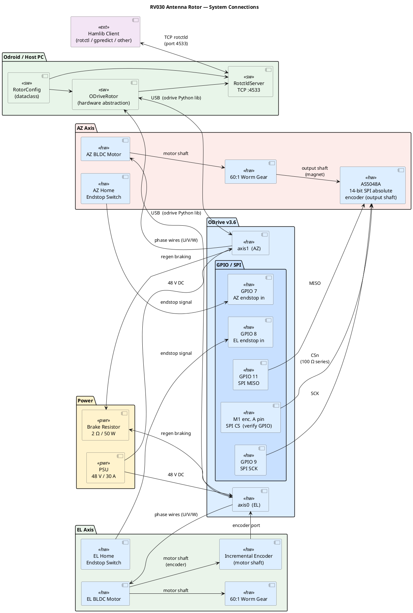

# rotator-rv030

Antenna rotor controller — ODrive v3.6 + AS5048A SPI encoder, exposed as a `rotctld`-compatible TCP server.

## System diagram

> Source above — edit with any PlantUML-capable tool (VS Code PlantUML extension, `plantuml.jar`, or the [online server](https://www.plantuml.com/plantuml)).

## Files

| File | Purpose |
|------|---------|
| `odrive_rotctld_fw056_60to1_autocal_homing.py` | Main daemon — rotctld server + ODrive control |
| `AS5048A_SPI_wiring.md` | AS5048A wiring and first-run calibration procedure |
| `.github/copilot-instructions.md` | Copilot context for this repo |
